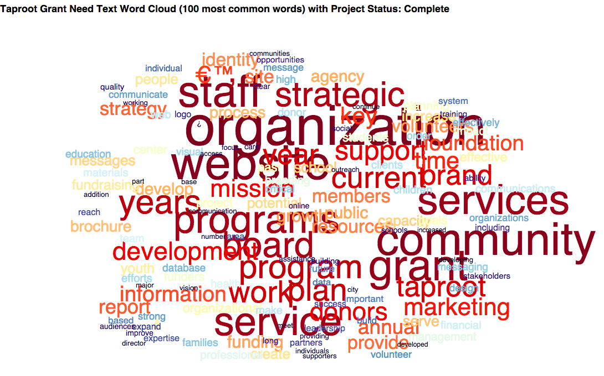

## DAtaKind & Teradata DataDive in Anaheim (October 16-17, 2015)
---

###### 1. Taproot "grant need" text Word Cloud (100 most common words) with project status either Complete or Declined. Example:

